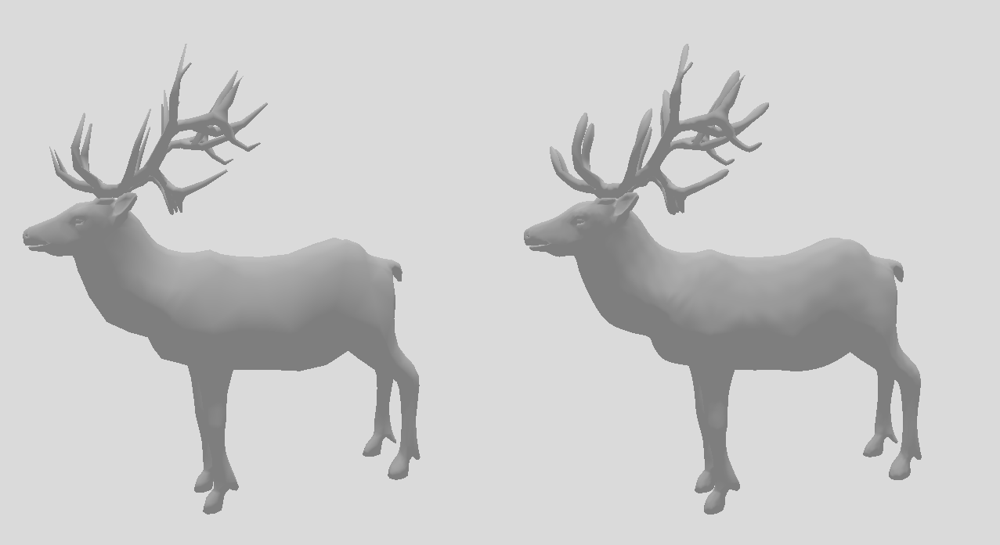
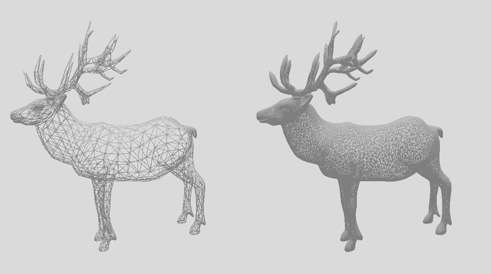

# 3. vjezba - PN Trokuti

## Uvod
Cilj vježbe je implementirati metodu zaglađivanja temeljenu na ovom [radu](https://alex.vlachos.com/graphics/CurvedPNTriangles.pdf). Pokušavamo pomoću Bezierove površine (trokuta) "zagladiti" trokute koji čine učitani model. Za svaki trokut izgeneriramo 10 točaka koje se dalje koriste u formuli Bezierovog trokuta, pomoću čega se obavlja teselacija objekta.
Sam način izglađivanja nije namjenjen zamjeni umjetnika koji izradi model, već izgladiti grublje modele.

## Pokretanje
Nakon učitavanja Visual Studio (2019) solution-a, treba konfigurirat projekt da koristi Vulkan SDK, GLFW i GLM, kako bi se mogao Build-at.
Za samo pokretanje aplikacije potrebno je preko naredbene linije predat mu putanju do modela kojeg se želi učitati. Trenutno je postavljeno na [deer.obj](pn_triangles/models/deer.obj).

## Kontrole
Pozicijom kamere, rotacijom modela i wireframe mode-om može se upravljati putem tipkovnice. Tipke s funkcioalnošću su:

- TAB - Uključuje/isključuje wireframe
- ADD(+) - Povećava razinu teselacije (max. 10)
- SUBTRACT(-) - Smanjuje razinu teselacije (min. 1)
- ESCAPE - Zatvori prozor i aplikaciju
- UP - Pomakni kameru prema gledištu(modelu)
- DOWN - Odmakni kameru od gledišta
- A - Rotiraj model za 5 stupnjeva u negativnom smjeru po osi Y
- D - Rotiraj model za 5 stupnjeva u pozitivnom smjeru po osi Y
- W - Rotiraj model za 5 stupnjeva u negativnom smjeru po osi Z
- S - Rotiraj model za 5 stupnjeva u pozitivnom smjeru po osi Z
- R - Resetiraj rotaciju modela

## Primjeri rada

